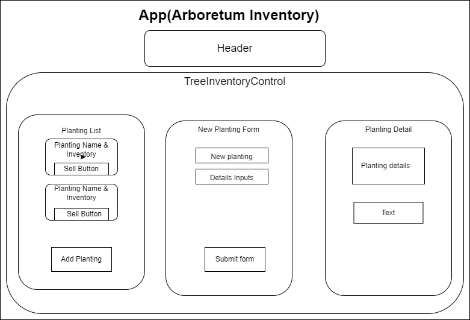

# If it Ain't Burr Oak Arboretum Inventory Tracker

#### By: Louie Knolle



#### Allows user to create, read, update and delete tree plantings at an arboretum and keep track of inventory.

## Technologies Used

* React.js
* Tailwind CSS
* JavaScript
* Webpack
* ESLint
* Node.js


## Description 

This application mimics an inventory tracking system someone might use running an arboretum.  The app has full CRUD functionality for tree plantings and allows the user to keep track of trees currently in stock in each planting.  The sell button the main page decrements the inventory by 1 for each time it is pressed, then becomes disabled and reads "Sold Out" when Inventory reaches zero.

## Setup/Installation Requirements

* _Use a command line terminal to clone the repository from Github by inputting ```git clone https://github.com/louieknolle/if-it-aint-burr-oak-arboretum.git```_
* _Install Node.js_
* _Run command ```cd if-it-aint-burr-oak-arboretum``` to navigate to project directory_
* _Open the project in VSCode or text editor of choice_
* _In the terminal again, run the following commands to complete your developer environment_
  * _```npm install``` to install the webpack dependencies_
  * _```npm start``` to launch the development server_


## Known Bugs

* _No Known Bugs at This Time_


## License

_Email knollelw@gmail.com with any comments or contributions. This software is licensed under the MIT license_

Copyright (c) _2022_ _Louie Knolle_